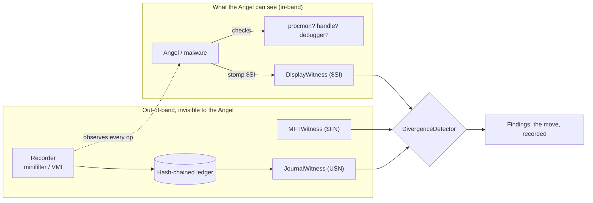

# Weeping Angel

[](https://github.com/norwytch/weeping-angel/actions/workflows/ci.yml)
[](https://www.python.org/)
[](LICENSE)
[](https://attack.mitre.org/techniques/T1070/006/)

Detecting timestomping malware that acts only when it believes it is unobserved.

In the classic British sci-fi series Doctor Who, a Weeping Angel is an entity that can only move when it is not being observed. Under direct observation, it must remain in the form of a graveyard statue, perfectly still. When freed from observation, Weeping Angels can move faster than light through space in order to reach their victims and feed off their "temporal energy," including movement through digital signal networks. This means that Weeping Angels could also potentially be used for malware. 

In this repo, we imagine a piece of malware with similar capabilities (lateral movement only under lack of observation) and goal (disrupting a target's timeline) as the show. Of course, we are ultimately bound by the fact that the Angels are imagined as "quantum" entities, and we are constrained by classical computing systems. Nevertheless, we imagine this piece of malware as the following mapping:

| Doctor Who | This system |
|---|---|
| The Angel | Anti-forensic malware that timestomps |
| Moving | Writing forged `$STANDARD_INFORMATION` timestamps |
| Being observed | The malware's self-report: in-band checks for Procmon, EDR, open handles, a debugger |
| Quantum-locked / turned to stone | Dormant whenever its self-report says "observed" |
| Two Angels locking each other | Independent witnesses that must agree; their disagreement is the fingerprint |
| Temporal paradox | An append-only, tamper-evident record you cannot rewrite without a contradiction |
| Looking from outside time | Out-of-band observation (kernel minifilter, hypervisor/VMI) it cannot perceive |

## Core design principles

1. Out-of-band observation. The malware checks for in-band observers (userland
   processes, handles, debuggers). Observe from below or outside it (a kernel
   minifilter, or a hypervisor watching the guest) so its precondition for
   acting is always false in reality while it cannot tell.
2. Multi-witness divergence. Keep several independent timestamp sources that
   must agree if nothing forged anything. No single witness catches the Angel;
   their disagreement does.
3. Tamper-evident ledger. A forward hash-chained, append-only log where every
   record commits to its predecessor. Editing the past breaks the chain.

For more detail, consult [the threat model](docs/THREAT_MODEL.md).



## Quickstart

```bash
git clone <this repo> && cd weeping_angel
python examples/demo.py                       # narrated walkthrough of the scenarios
python -m quantumlock.adapters.mft examples/data/sample.mft          # parse a raw $MFT and scan it
python -m quantumlock.efficacy                # precision/recall over a labeled corpus
python examples/arena_demo.py                 # adversarial arena: Angels vs the recorder
pip install -e ".[test]" && pytest -q         # 66 tests
```

## Facing the Angels

Angels are one of the most feared entities in the Whoniverse. It's important to know how to detect and defeat them in your system! `python examples/demo.py` runs the full arc on a simulated Angel.

1. Move. With no in-band observer present, `Angel.tick` (`quantumlock/simulator.py`)
   writes forged `$SI` timestamps and returns `MOVING`. The same operation is
   recorded out-of-band in the ledger, which the Angel cannot see.
2. Detect. Because the out-of-band witnesses kept the true values,
   `DivergenceDetector.scan` (`quantumlock/detector.py`) finds they disagree and
   fires R1, R2, R4, and R6 in scenario 1. Nothing the Angel could observe was
   used to catch it.
3. Defeat. Two ways. If it believes it is observed it goes `STONE` and never acts
   (scenario 2). When an `AdvancedAngel` tries to erase the record (scenario 3),
   the hash-chained ledger breaks on any interior edit and the off-box anchor
   catches a dropped tail. The closing proof (`quantumlock/paradox.py`) shows the
   "moved but unrecorded" state is unreachable while out-of-band observation
   holds.

Sample output (abridged):

```
Scenario 1 -- the Angel moves while it believes no one is watching
  Angel.tick -> MOVING  (it sees no in-band observer)
  Three independent witnesses disagree:
  [HIGH] R1_si_fn_birth_divergence   display($SI) vs mft($FN)
  [HIGH] R2_si_journal_rollback      display($SI) vs journal(USN)
  [HIGH] R4_setinfo_captured         journal(USN)  the forgery caught in the act

Scenario 2 -- the Angel freezes because it believes it is watched
  Angel.tick -> STONE   no divergence, quantum-locked (harmless)

Scenario 3 -- the Angel also tries to rewrite history
  ledger.verify().ok = False   broken chain link, cannot rewrite the past
```

The scenario 1 forgery is internally consistent (created before modified, looks
like an old file), so single-source heuristics miss it. It still cannot survive
a witness it could not reach.

## Detection rules

| Rule | Witnesses | What it catches |
|---|---|---|
| `R1_si_fn_birth_divergence` | `$SI` vs `$FN` | Displayed creation predates the kernel-set MFT birth |
| `R2_si_journal_rollback` | `$SI` vs USN | Displayed modified predates the journal's true last write |
| `R3_internal_ordering` | `$SI` | Modified precedes its own creation (impossible) |
| `R4_setinfo_captured` | USN | A metadata-set op writing a value that contradicts ground truth: predates the `$FN` birth, rolls back before the true last write, or is in the future |
| `R5_future_timestamp` | `$SI` | A timestamp in the future |
| `R6_subsecond_truncation` | `$SI` vs `$FN`/USN | `$SI` zeroed to whole seconds while a witness keeps 100ns precision, the nanoseconds-zeroed tell of `SetFileTime`-based stompers |

Every `Finding` is tagged to MITRE ATT&CK
[T1070.006](https://attack.mitre.org/techniques/T1070/006/) (Indicator Removal:
Timestomp). Sigma rules and a Sysmon config keyed on Sysmon Event ID 2
(FileCreateTime), the live telemetry for this technique, are in
[`detections/`](detections/).

## Implemented vs design-only

Working, tested Python in this repo:

- `quantumlock/ledger.py`, tamper-evident hash-chained log, plus
  `quantumlock/anchor.py`, HMAC-authenticated off-box head anchor that closes
  the tail-truncation gap.
- `quantumlock/witnesses.py` and `quantumlock/detector.py`, the witness model
  and six ATT&CK-tagged divergence rules.
- `quantumlock/paradox.py`, the observed/unobserved state machine with an
  unreachability proof.
- `quantumlock/simulator.py`, a deterministic filesystem and Angel simulator.
- `quantumlock/adapters/mft.py`, parses a raw NTFS `$MFT` (FILE records, Update
  Sequence Array fixups, FILETIME decoding) and runs the rules on it;
  `adapters/mft_csv.py` does the same from an MFTECmd CSV export.
- `quantumlock/efficacy.py`, precision/recall over a labeled corpus.
- `quantumlock/arena.py`, an adversarial bot-vs-bot game (Angels vs the
  out-of-band recorder under a coverage budget) with baseline and inference agents.
- `kaggle/weeping_angel.py`, the same game packaged as a
  [kaggle-environments](https://github.com/Kaggle/kaggle-environments) simulation
  (`pip install -e ".[arena]"`), ready for a bot-vs-bot competition.

Design-only (documented, not executable here): the kernel minifilter,
hypervisor/VMI vantage point, and live USN collection. The real data source for
each witness is spelled out in
[`quantumlock/adapters/windows.py`](quantumlock/adapters/windows.py) and
[`docs/DESIGN.md`](docs/DESIGN.md).

## Notes/Concessions to realism

- A sophisticated sample need not use a clean observed/unobserved binary. It may
  stomp probabilistically or on a timer, leaving no single blink to exploit. The
  defense assumes it acts and relies on indelible recording, not on freezing it.
- Freezing it with fake observers (a decoy Procmon process, a held handle) is
  on-theme but brittle, since it depends on enumerating its exact checks. Treat
  it as a tripwire, not the core.
- Tamper-evidence protects the recorded past. It cannot recover a value the
  recorder never saw, so recorder coverage is the real security boundary.
- The latest ledger record can still be dropped unless its head is anchored
  off-box. `quantumlock/anchor.py` implements that anchor, so a dropped tail
  surfaces as "the anchored head is ahead of what's on disk." See
  [`docs/DESIGN.md`](docs/DESIGN.md).
- Setting an old timestamp is not inherently malicious; archivers,
  restore/backup, `cp -p`, and `rsync -t` all do it. `R4` therefore fires only
  when a captured `setinfo` contradicts an out-of-band ground truth, and exempts
  an allowlist of known-legitimate setters (`trusted_setinfo_actors`), matched
  on the recorder-supplied image path or signer, not a spoofable name.

## Layout

```
quantumlock/            # the package: detection logic and the simulation that exercises it
  ledger.py             # hash-chained, append-only, tamper-evident log
  anchor.py             # HMAC-authenticated off-box head anchor (closes tail-truncation)
  witnesses.py          # $SI / $FN / USN witnesses over a common interface
  detector.py           # six divergence rules -> ATT&CK-tagged findings
  paradox.py            # observed/unobserved state machine + unreachability proof
  simulator.py          # filesystem sim, observation oracle, Angel agents
  efficacy.py           # precision/recall harness over a labeled corpus
  arena.py              # adversarial Angels-vs-recorder game (coverage budget)
  adapters/windows.py   # design-only real-artifact adapters
  adapters/mft.py       # executable: parse a raw NTFS $MFT and run the rules
  adapters/mft_csv.py   # executable: run the rules over an MFTECmd CSV export
kaggle/                 # the arena as a kaggle-environments sim (bot-vs-bot, optional dep)
detections/             # ATT&CK map, Sigma rules, Sysmon config (Event ID 2)
examples/               # demo.py, plus data/ (raw $MFT sample + generator, MFTECmd CSV)
docs/                   # DESIGN.md, THREAT_MODEL.md
tests/                  # 66 tests, incl. Hypothesis property tests
```

## License

MIT, see [LICENSE](LICENSE).

